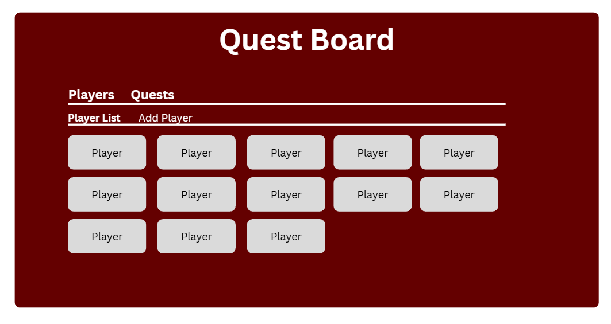
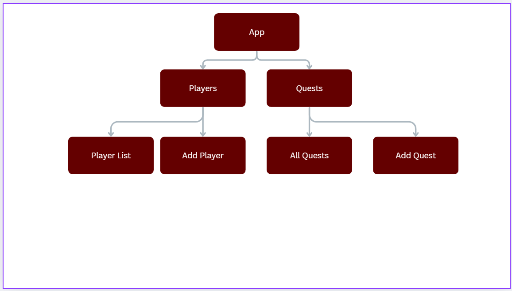
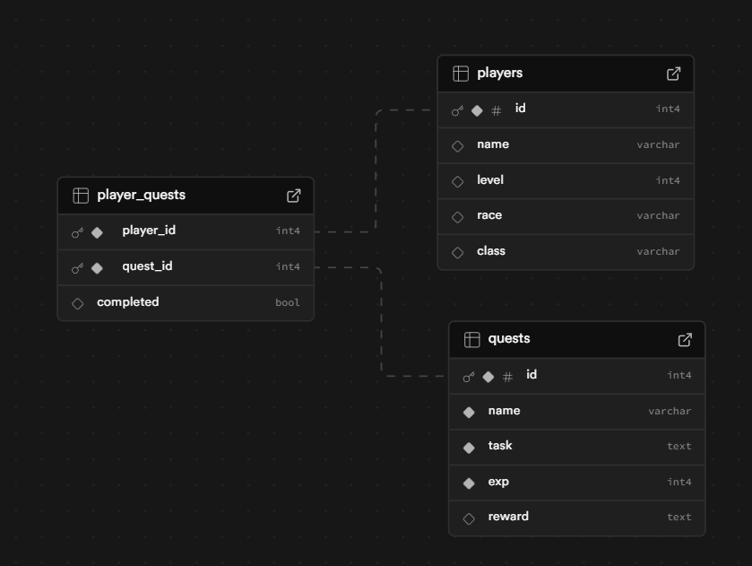

# Planning

## Layout

The website will be a dashboard for adding players and quests, and assigning players to the quests that have been added.
There will be two sections to the website: The players section and the quests section.

Following the site map, within the players section, there will be a list of players shown, and a form to add new players

similarly, the quests section will show a list of quests and a form to add new quests

I want the site to feel natural when using it where the user starts at the top of the page and they go further down as they navigate the website. Upon a new page, such as a specific quest page or a player page, the options will be at the bottom

## Database

The database will have a table to store players and a table to store quests. With this project, I think it would be important for a player to pick up many quests at a time, and a quest can also be picked up by many different characters. Due to the nature of the project, I believe that I need a many-to-many relationship database in this instance. After some research, I've come to understand that because of the relationship between the two tables that I'll need a third table to hold the list of values pertaining to the player IDs and the quest IDs.

I'll also create a column in the third table to hold a value as to whether the quest has been completed or not for filtering purposes if I get that far!

